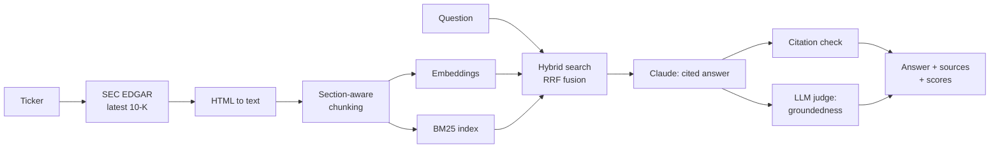

# SEC Filings Research Assistant

Ask plain-English questions about any public company's latest **10-K** and get answers that are **cited to the exact filing passages** and **automatically checked for groundedness**.

Built with Python, FastAPI, hybrid retrieval (dense embeddings + BM25), and the Anthropic Claude API.

> Example: *"How did total net revenue change compared with the prior year?"* → a short answer with numbered citations, a groundedness score, citation coverage, latency, and the source passages it used.

## Features

- **Pulls filings straight from SEC EDGAR**: enter a ticker and the latest 10-K is downloaded, cleaned and indexed.
- **Section-aware chunking**: chunks never cross 10-K "Items" (Business, Risk Factors, MD&A...), and every source shows which section it came from.
- **Hybrid search**: dense embeddings for meaning plus BM25 for exact terms (figures, product names, defined terms), merged with reciprocal rank fusion.
- **Cited answers**: Claude answers only from retrieved passages, cites every claim, and refuses when the filing doesn't contain the answer.
- **Built-in evaluation**: every answer gets a rule-based citation check and an LLM-as-judge groundedness score, with unsupported claims listed.
- **Eval harness**: a fixed question set (including unanswerable questions) reports refusal accuracy, groundedness, citation coverage, and p50/p95 latency.
- **Three ways to use it**: web UI, REST API, and CLI.

## Architecture



## Quickstart

Requires Python 3.10+ and an [Anthropic API key](https://console.anthropic.com).

```bash
git clone https://github.com/kavya551-svg/sec-filings-rag.git
cd sec-filings-rag

python -m venv .venv
source .venv/bin/activate        # Windows: .venv\Scripts\activate
pip install -r requirements.txt

cp .env.example .env             # Windows: copy .env.example .env
# then edit .env: add ANTHROPIC_API_KEY and SEC_USER_AGENT ("Your Name your@email.com")
```

The first run downloads a small embedding model (about 90 MB) that runs locally on CPU.

## Usage

### Web UI

```bash
uvicorn app.api:app --reload
```

Open http://localhost:8000, enter a ticker (e.g. `MSFT`), click **Load filing**, then ask questions. Click a citation number to jump to its source passage.

### CLI

```bash
python cli.py ingest MSFT
python cli.py ask MSFT "What are the most significant risk factors?"
```

### REST API

Interactive docs at http://localhost:8000/docs.

```bash
curl -X POST localhost:8000/api/ingest -H "Content-Type: application/json" -d '{"ticker": "MSFT"}'
curl -X POST localhost:8000/api/ask -H "Content-Type: application/json" \
     -d '{"ticker": "MSFT", "question": "How many employees does the company have?"}'
```

Response shape (abridged):

```json
{
  "answer": "As of June 30, the company employed approximately ... full-time employees [2].",
  "filing": {"company": "...", "form": "10-K", "filing_date": "...", "url": "..."},
  "sources": [{"id": 1, "section": "Item 1. Business", "text": "...", "dense_rank": 1, "bm25_rank": 3}],
  "evaluation": {"refused": false, "groundedness": 1.0, "verdict": "grounded",
                 "citation_coverage": 1.0, "invalid_citations": [], "unsupported_claims": []},
  "latency_ms": {"retrieval": 40, "generation": 2100, "evaluation": 1500, "total": 3640}
}
```

## Evaluation

```bash
python evals/run_evals.py MSFT
```

Runs the questions in `evals/questions.json` (8 answerable, 2 that a 10-K can't answer) and writes `evals/results_MSFT.md` with:

| Metric | What it measures |
|---|---|
| Answer/refusal accuracy | Answers answerable questions and refuses unanswerable ones |
| Mean groundedness | LLM-judge score (0 to 1) of how well claims are supported by sources |
| Mean citation coverage | Share of answer sentences that carry a citation |
| Latency p50 / p95 | End-to-end time per question, including evaluation |

## Design decisions

- **Hybrid search over pure vector search.** Financial filings are full of exact terms and numbers that embeddings blur together. BM25 catches them; reciprocal rank fusion combines both rankings without needing to calibrate their scores.
- **Chunks respect filing structure.** Splitting by 10-K Item keeps passages coherent and makes citations meaningful ("Item 1A. Risk Factors" rather than "chunk 412").
- **Two independent checks.** The citation check is cheap and deterministic; the LLM judge catches claims that are cited but not actually supported.
- **Explicit refusal.** The assistant is instructed to say when the filing doesn't answer a question, and the eval set includes questions that should be refused.
- **Local embeddings.** No embedding API key or cost; the index is a NumPy array saved to disk, which is plenty for one filing (a few hundred to a few thousand chunks).

## Project structure

```
app/
  edgar.py      # SEC EDGAR download and HTML-to-text
  chunking.py   # section-aware chunking
  index.py      # embeddings + BM25 + reciprocal rank fusion
  llm.py        # cited answers, citation check, LLM judge
  pipeline.py   # ingest and ask
  api.py        # FastAPI service
  static/       # web UI
cli.py          # command-line interface
evals/          # question set and eval runner
tests/          # unit tests (no API key or network needed)
```

## Tests

```bash
pytest
```

The unit tests cover chunking, hybrid search, citation checks, and judge parsing using a fake embedder and fake LLM client, so they run offline.

## Next steps

- Swap the NumPy index for a managed vector database (e.g. Pinecone) to search across many filings at once.
- Add a cross-encoder reranker after fusion.
- Compare a company's filings across years ("How did risk factors change since last year?").

---

Built by [Kavya Shetty](https://www.linkedin.com/in/kavyashetty3/) · [Portfolio](https://kavya551-svg.github.io/kavyashetty/)
